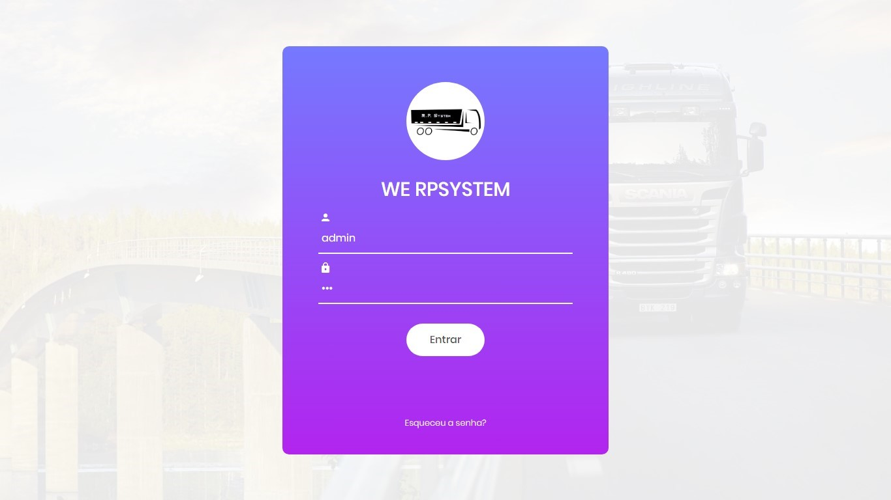
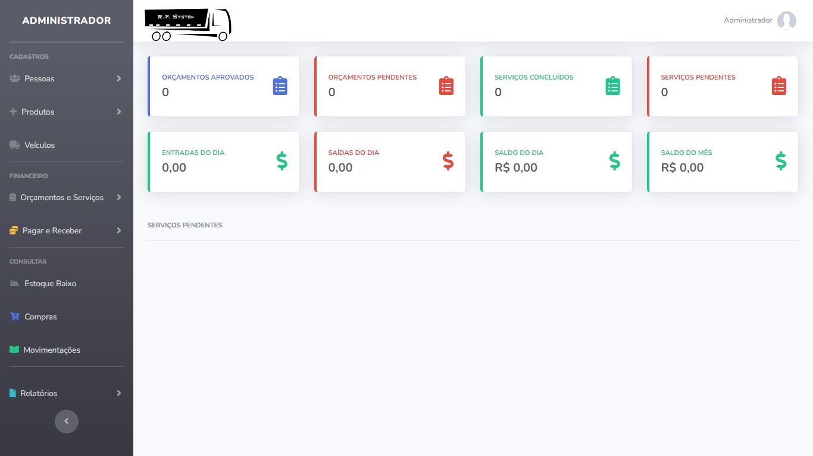
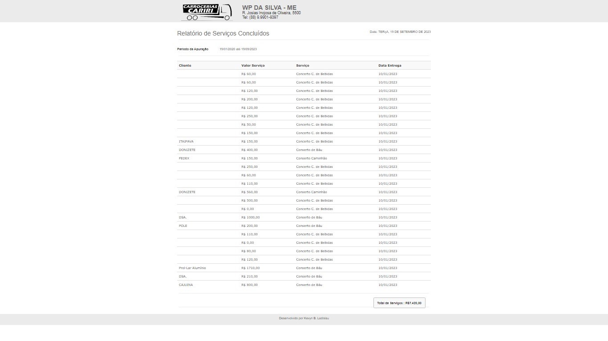

<h1 align="center">.:| SISTEMA AUTOMAÇÃO COMERCIAL |:.</h1>

 

<h2 align="center">📖Descrição</h2>

Esse é um projeto que desenvolvi para meu TCC do curso de Bacharelado em Sistemas de Informação, intitulado: <a href="https://drive.google.com/file/d/10xukqjIqlD-N8PJiCXs8GgoVmTBSy23m/view?usp=drive_link">DESENVOLVIMENTO DE SISTEMA WEB DE AUTOMAÇÃO COMERCIAL GERADOR DE ORÇAMENTOS DE SERVIÇOS</a>, em 2020. Aprimorado e comercializado em 2021 para a empresa WE Carrocerias Cariri, o centro do estudo desse trabalho, focado em diminuir a perca de papeladas que prejudicava essa micro empresa. 

 

<h2 align="center">🖥Preview</h2>

##### Tela de Login
</img>

##### Tela de Administração
</img>

##### Tela de Relátorio
</img>

 

<h2 align="center">🖥Funcionalidades do Projeto</h2>

- Sistema de login
- CRUD de clientes, funcionários, fornecedores, categorias, produtos, tipo de serviços e veiculos
- Sistema gerador de orçamentos
- Sistema de cotação
- Sistema de controle de estoque
- Sistema de controle financeiro
- Sistema de Relátorios 

 

<h2 align="center">🛠 Tecnologias</h2>

- [HTML5](https://html.com/)
- [CSS3](https://developer.mozilla.org/pt-BR/docs/Web/CSS)
- [Javascript](https://www.javascript.com)
- [jquery](https://jquery.com/)
- [PhpMyAdmin](https://www.phpmyadmin.net/)
- [bootstrap 4](https://getbootstrap.com)

 

<h2 align="center">⚡️ Demonstração</h2>

Para testar o projeto, deve primeiramente baixar o <a href="https://www.apachefriends.org/pt_br/download.html">xampp</a> 

Com o mesmo instalado, baixar o <a href="https://github.com/KevynFirst/sistema-werpsystem/archive/refs/heads/main.zip">projeto</a> e colar na pasta htdocs do xampp 

Agora abra o xampp e em seguida inicie o apache e o MySQL

Abra PhpMyAdmin apertando em admin na opção do MySQL 

Repasse o backup do banco de dados chamado rpsystem.sql

No navegador digite localhost/sistema-werpsystem e já estará em funcionamento. O login para entrar no painel de administração é:

- Login: admin
- senha: 123

<!-- ### Veja o projeto funcionando <a href="https://kevynfirst.github.io/primeiro-projeto">aqui</a>. 👈 -->

 

<h2 align="center">😉 Obrigado por visitar meu projeto</h2>

Você pode conferir outros projetos que desenvolvi aqui no meu GitHub, ou entrar em contato comigo pelos demais links.

